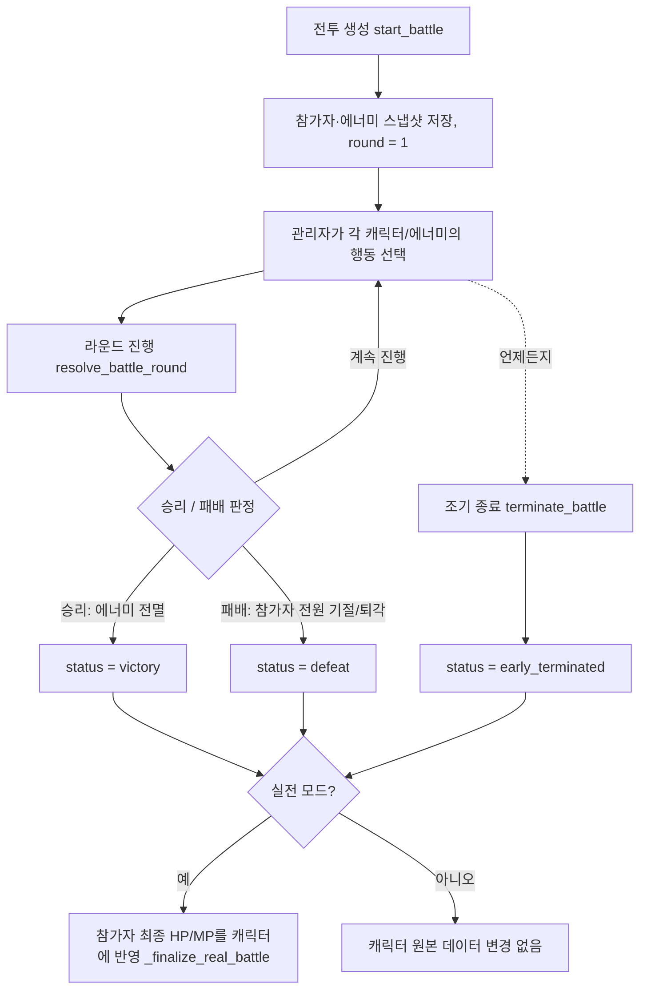

# 전투 플로우 & 계산식 정리

이 문서는 전투 시스템이 어떻게 동작하는지, 그리고 러너/에너미/소환수의 행동이 어떤 수식으로 계산되는지 정리한 것입니다.
실제 로직은 `apps/api/app/crud.py`의 `# ── Battle ──` 구역(`resolve_battle_round` 함수가 핵심)에 있으며, 이 문서는 그 코드를 사람이 읽기 쉽게 옮긴 것입니다. 코드와 문서가 어긋나면 **코드가 항상 정답**이니, 로직을 변경했다면 이 문서도 함께 업데이트해 주세요.

## 1. 기본 개념

- **모의전(practice) / 실전(real)**: 둘 다 같은 엔진으로 진행되지만 차이가 있습니다.
  - 실전만 라운드 진행 전 상태를 스냅샷으로 남겨 "이전 라운드 되돌리기"가 가능합니다.
  - 실전이 끝나면(승리/패배/조기종료) 캐릭터의 실제 HP·MP가 전투 결과로 갱신됩니다(`_finalize_real_battle`). 모의전은 캐릭터 원본 데이터에 아무 영향을 주지 않습니다.
  - 실전에서 소모형 아이템을 쓰면 실제 보유 수량이 차감됩니다. 모의전은 소모되지 않습니다.
- **참가자(participants)**: 전투에 참여한 캐릭터들의 "스냅샷"입니다. 전투 시작 시점의 능력치를 그대로 복사해 오며, 전투 도중에는 이 스냅샷만 변경됩니다(원본 캐릭터 데이터는 실전 종료 시에만 반영).
- **에너미(enemies)**: 마찬가지로 전투 시작(또는 난입) 시점의 스냅샷입니다.
- **소환수(summons)**: 에너미가 "소환" 계열 기술을 사용하면 전투 중에 생성되는 임시 참가자입니다. 이름이 같은 소환수가 여럿이면 로그에 `이름1`, `이름2`처럼 번호가 붙습니다.
- **라운드(round)**: 전투는 1라운드부터 시작해 승패가 갈릴 때까지 관리자가 매 라운드 캐릭터/에너미의 행동을 지정하고 "라운드 진행"을 눌러 한 번에 처리합니다.

## 2. 전투 생성부터 종료까지 흐름



- 전투 도중 새 캐릭터/에너미를 **난입**시킬 수 있습니다(`join_battle`, `join_battle_enemy`). 난입한 참가자는 합류한 그 라운드에는 행동할 수 없고, 공격/치유 대상도 되지 않습니다(다음 라운드부터 정상 참여).
- 실전은 `undo_last_round`로 직전 라운드를 되돌릴 수 있습니다. 그 라운드 시작 전 스냅샷으로 복원하고 로그 한 줄을 지웁니다.

## 3. 한 라운드 안에서의 처리 순서

`resolve_battle_round`는 매 라운드마다 아래 순서를 **정확히 이 순서대로** 실행합니다. 순서 자체가 규칙이므로 바뀌면 게임 밸런스가 달라집니다.

| 단계 | 내용 |
| --- | --- |
| 0 | **라운드 시작 재생** — 생존한 모든 참가자(난입 캐릭터 포함)가 HP/MP 재생. |
| 1 | **수비 태세 표시** — `수비`를 선택한 캐릭터를 표시만 해 둠(실제 경감은 4단계에서 적용). |
| 2 | **캐릭터 행동 처리** — `공격/기술 사용`, `아이템 사용`, `퇴각`을 순서대로 처리. (치유는 여기 포함 안 됨) |
| 2.5 | 이 시점에 에너미가 전부 죽었는지 확인해 **승리 여부를 미리 판정**. 승리가 확정되면 치유·에너미 행동을 생략. |
| 3 | **치유 처리** — 퇴각하지 않은 캐릭터의 `치유` 행동. |
| 4 | **에너미 행동 처리** — 지정 공격 / 광역 공격 / 소환. |
| 5 | **소환수 행동 처리** — 살아있는 소환수가 자동으로 한 명을 공격. |
| 6 | 승리/패배/라운드 증가 판정 후 로그 기록, 실전이면 마무리 반영. |

같은 단계 안에서는 프론트에서 보낸 캐릭터/에너미 배열 순서대로 처리됩니다.

### 대상이 될 수 있는지 판정하는 기준

| 함수 | 의미 |
| --- | --- |
| `active(p)` | 기절(downed)하지 않고 퇴각(retreated)하지도 않았음 |
| `just_joined(p)` | 이번 라운드에 막 난입함 → 행동 불가, 대상도 안 됨 |
| `targetable(p)` | `active(p)` 이면서 `just_joined(p)`가 아님 → 공격/치유 대상이 될 수 있음 |
| `enemy_targetable(e)` | HP > 0 이면서 이번 라운드에 막 난입한 에너미가 아님 |

## 4. 캐릭터(러너) 행동 계산식

캐릭터가 라운드에 고를 수 있는 행동: `공격/기술 사용`, `수비`, `치유`, `아이템 사용`, `퇴각`, `무반응`.

### 공통: 마나계수

기술 사용에는 `기술 비용(skill_cost)`만큼 마나가 필요합니다.

- 마나가 **충분**하면(`mp >= skill_cost`): 마나를 소모하고 `마나계수 = 1`
- 마나가 **부족**하면: 마나를 소모하지 않고 `마나계수 = 0.5` (위력이 절반으로 줄어듦)

기술 등급 계수도 공통으로 쓰입니다.

```
기술등급계수 = 1 + 기술 등급(skill_lv) × 기술 효율·비례(skill_eff_fixed)
```

### 4-1. 공격 / 기술 사용

```
피해 = round(
  (공격력 × (1 + 공격력 증폭) + 기술 효율·고정)
  × (1 + 피해 증폭)
  × 기술등급계수
  × 마나계수
)
```

- 소환수가 살아있으면 **소환수를 먼저** 때립니다(가장 먼저 등록된 살아있는 소환수 1체). 초과 피해는 다른 대상에게 넘어가지 않습니다(오버킬 처리만 로그에 표시).
- 소환수가 없으면 지정한 에너미를 공격합니다. 지정 대상이 없거나 대상이 될 수 없으면(난입 중이거나 죽음) 살아있는 에너미 중 가장 앞의 대상으로 자동 변경됩니다.

### 4-2. 수비

즉시 피해를 주지 않고, 이번 라운드에 에너미의 "지정 공격"을 맞을 때 아래 방어력만큼 피해를 경감합니다(4-4 참고).

```
방어경감량 = round(방어력 × (1 + 방어력 증폭) × 방어 효율)
```

### 4-3. 치유

```
치유량 = round(
  (치유 효율 + 기술 효율·고정) × 기술등급계수 × 마나계수
)
```

- 대상 수는 `max(1, 기술 대상(skill_target))`명입니다.
- 1순위 대상은 화면에서 지정한 캐릭터(대상이 될 수 있을 때만). 나머지 자리는 **체력 비율(현재HP/최대HP)이 낮은 순**으로 자동 채웁니다.
- 오버힐(over_heal)이 켜진 대상은 최대 체력을 넘겨서 누적될 수 있고, 꺼져 있으면 최대 체력에서 잘립니다.
- 승리가 이미 확정된 라운드에는 치유 자체가 생략됩니다.

### 4-4. 에너미의 "지정 공격"을 맞을 때 (러너 피격 계산)

```
1) base = round(에너미 공격력 × 기술 위력(damage_percent) / 100)
2) dmg  = round(base × (1 − 피해 감소))
3) 이번 라운드 '수비'를 선택했다면: dmg = max(0, dmg − 방어경감량)
4) 보호막이 있으면 min(보호막, dmg)만큼 흡수하고 dmg에서 차감
5) 남은 dmg만큼 HP 감소 (HP는 0 밑으로 내려가지 않음)
```

- 보호막 총량 = `보호막(sh) + 시작 보호막(start_sh)` (전투 시작 시 합산되어 스냅샷의 `shield` 값이 됨).
- HP가 0이 되면 그 즉시 기절(downed) 처리됩니다.

### 4-5. 아이템 사용

아이템 효과(effects)를 그대로 스냅샷에 더합니다. 대부분의 능력치는 `수치 + 효과값`으로 더해지고, `hp_heal_p`(최대 체력 비례 회복) 효과만 예외적으로 `최대 체력 × 효과값`만큼 HP를 더합니다. 오버힐이 꺼져 있으면 최대 체력에서 잘립니다.

실전 모드에서는 실제 보유 수량을 확인해 부족하면 사용이 거부되고, 성공하면 사용 이력이 남고 보유 수량이 차감됩니다.

### 4-6. 퇴각

즉시 `retreated = true`. 이후 라운드부터는 대상도 되지 않고 행동도 하지 않습니다(치유 대상에서도 제외).

## 5. 에너미 행동 계산식

에너미가 고를 수 있는 행동: 지정 공격(A/B), 광역 공격(A/B), 소환, 무반응. "A/B"는 표기상 구분일 뿐 계산 로직 차이는 없고, **기술 이름이 "광역"으로 시작하는지**만 지정/광역을 가릅니다.

### 5-1. 에너미 최대 체력 보정 (전투/난입 시점 1회 계산)

```
최종 HP = 기본 HP
        + (공격 진영 인원수 × 공격 인원당 보너스)
        + (수비 진영 인원수 × 수비 인원당 보너스)
        + (치유 진영 인원수 × 치유 인원당 보너스)
```

파티 구성은 에너미가 전투에 들어온 시점(전투 시작 또는 중간 난입 시점)의 참가자 목록 기준이며, 이후 파티가 바뀌어도 다시 계산되지 않습니다.

### 5-2. 지정 공격 (대상 수만큼)

```
대상 = 대상이 될 수 있는 캐릭터 중 (주목도 + 존재감) 내림차순으로 target_count 명
base = round(에너미 공격력 × 기술 위력(damage_percent) / 100)
각 대상마다:
  dmg = round(base × (1 − 그 캐릭터의 피해 감소))
  그 캐릭터가 이번 라운드 수비 중이면: dmg = max(0, dmg − 그 캐릭터의 방어경감량)
  보호막이 있으면 min(보호막, dmg)만큼 흡수 후 차감
  남은 dmg만큼 HP 감소, 0이 되면 기절
```

### 5-3. 광역 공격

대상이 "대상이 될 수 있는 캐릭터 전원"이라는 점만 다르고, 피해 계산(피해 감소 → 수비 경감 → 보호막 흡수 → HP 감소)은 지정 공격과 동일합니다.

### 5-4. 소환

`summon_count`만큼 소환수를 생성합니다. 소환수는 `summon_hp`/`summon_attack` 값을 그대로 가지며, 생성된 그 라운드에는 행동하지 않고 **다음 라운드부터** 자동으로 공격합니다.

## 6. 소환수 행동

살아있는 소환수는 매 라운드 자동으로 행동합니다(에너미처럼 직접 지정하지 않음).

```
대상 = 대상이 될 수 있는 캐릭터 중 (주목도 + 존재감)이 가장 높은 1명
dmg = round(소환수 공격력 × (1 − 대상의 피해 감소))
대상이 이번 라운드 수비 중이면: dmg = max(0, dmg − 대상의 방어경감량)
보호막이 있으면 min(보호막, dmg)만큼 흡수 후 차감
남은 dmg만큼 HP 감소, 0이 되면 기절
```

라운드 시작 시점에 살아있던 소환수만 그 라운드에 공격합니다(같은 라운드에 새로 소환된 소환수는 다음 라운드부터 행동).

## 7. 능력치 용어 정리

| 스탯 | 의미 |
| --- | --- |
| 공격력 / 공격력 증폭 | 기본 공격력과 그 배율 보정 |
| 방어력 / 방어력 증폭 / 방어 효율 | 수비 시 피해 경감량 계산에 쓰이는 3개 값 |
| 피해 증폭 | 내가 주는 피해에 곱해지는 배율 |
| 피해 감소 | 내가 받는 피해를 비율로 줄여주는 값 |
| 치유 효율 | 치유량의 기준값 |
| 기술 등급 / 기술 효율(고정) / 기술 효율(비례) | 공격·치유 위력에 더해지는 기술 관련 보정 |
| 기술 비용 | 공격/치유 시 필요한 마나. 부족하면 마나계수 0.5 |
| 기술 대상 | 치유가 동시에 적용되는 인원 수 |
| 주목도 / 존재감 | 에너미·소환수가 지정 공격 대상을 고를 때 우선순위 산정에 쓰임(둘의 합이 클수록 먼저 노려짐) |
| 보호막 | HP보다 먼저 피해를 흡수. `보호막 + 시작 보호막`이 전투 시작 시 합산됨 |
| 체력/마나 재생력(고정·비례) | 매 라운드 시작 시 자동 회복량 계산에 쓰임 |
| 오버힐 | 켜져 있으면 치유·회복형 아이템 효과가 최대 체력을 넘겨 누적 가능 |
| 시작 보호막·부활 후 체력·행동횟수 (관리자 전용) | 러너에게는 숨겨지는 값. 행동횟수는 현재 에너미 다중 행동 등 확장 여지로 남겨둔 필드이며 라운드 처리 로직에서는 아직 직접 쓰이지 않음 |

## 8. 정리되지 않은 부분 / 주의할 점

전투 로직을 코드로 직접 확인하면서 발견한, 아직 정리되지 않았거나 임시로 남아 있는 부분입니다. 이 영역을 건드릴 때는 특히 주의하세요.

- **"지정 공격A/B", "광역 공격A/B" 구분이 실제로는 없음**: 관리자가 에너미 기술을 만들 때 A/B를 골라 이름표와 배지 색만 다르게 붙일 수 있지만, `resolve_battle_round`는 기술 이름이 `"광역"`으로 시작하는지만 보고 지정/광역을 가릅니다. A와 B는 계산식·대상 선정에서 완전히 동일하게 처리됩니다. 향후 속성(예: 관통/약점 등)을 넣을 자리로 미리 만들어 둔 것으로 보이지만 현재는 구분에 아무 의미가 없습니다.
- **`행동횟수(act_time)` 필드가 전투 로직에서 사용되지 않음**: 에너미/캐릭터 생성 화면에서 값을 입력받고 저장은 하지만, `resolve_battle_round`·`_snapshot_combatant`·`_snapshot_enemy` 어디에서도 참조하지 않습니다. "한 턴에 여러 번 행동" 같은 기능을 염두에 두고 만들어 둔 필드로 보이나 아직 구현되지 않았고, 값을 바꿔도 전투 결과에 아무 영향이 없습니다.
- **기술 노드 "임시값"(`is_placeholder`)이 계산에서 실제 값과 완전히 동일하게 적용됨**: 관리자가 스킬 노드 효과를 아직 확정하지 못했을 때 "임시값" 배지를 달아둘 수 있는데, 이 표시는 UI 안내용일 뿐입니다. 러너가 그 상태에서 기술을 습득하면 `applied_effects`에 그대로 스냅샷되어 캐릭터 능력치와 전투 계산에 실제 값처럼 완전히 반영됩니다. 즉, 관리자가 값을 확정하기 전에 공개(`is_public`)해 버리면 미확정 수치가 그대로 전투 밸런스에 반영될 수 있습니다.
- **소환 개수를 0으로 지정할 방법이 없음**: 에너미 소환 기술 처리 코드에서 `skill.get("summon_count") or 1`을 쓰기 때문에, 관리자가 `summon_count`를 0으로 저장해도 실제 전투에서는 항상 최소 1마리가 소환됩니다. "이번엔 소환하지 않음"을 표현하려면 그 라운드에 소환 액션 자체를 선택하지 않는 수밖에 없습니다.
- **프론트엔드 전투 계산식 안내 문구가 실제 로직과 다름**: `apps/web/app/battle/components/BattleTab.tsx`의 `BATTLE_FORMULAS` 중 치유 공식 설명에 `"(1 + 치유 효율 증폭)"` 항이 남아 있는데, 이 능력치(`heal_eff_p`)는 이미 DB 마이그레이션(`migrations.py`)으로 완전히 제거된 값입니다. 실제 계산식은 이 문서 §4-3처럼 그 항 없이 동작합니다. 관리자 화면 안내 문구가 실제 로직보다 오래된 상태이니 별도로 수정이 필요합니다.

이 문서를 갱신하는 김에 위 항목들이 해결되면 이 섹션에서 지워 주세요.

## 9. 관련 코드 위치

| 내용 | 위치 |
| --- | --- |
| 전투 생성/조회/삭제/조기종료/난입 | `apps/api/app/crud.py` → `start_battle`, `get_battle_session`, `delete_battle_session`, `terminate_battle`, `join_battle`, `join_battle_enemy` |
| 라운드 처리(핵심 로직) | `apps/api/app/crud.py` → `resolve_battle_round` |
| 라운드 되돌리기 | `apps/api/app/crud.py` → `undo_last_round` |
| 실전 종료 시 캐릭터 반영 | `apps/api/app/crud.py` → `_finalize_real_battle` |
| API 엔드포인트 | `apps/api/app/main.py` (`/battles` 관련 라우트) |
| 관리자 전투 진행 화면 | `apps/web/app/battle/components/BattleArena.tsx` |
| 전투 시작/기록 목록 화면 | `apps/web/app/battle/components/BattleTab.tsx` |
