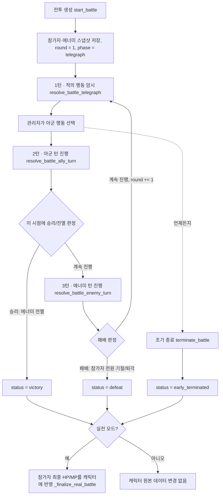

# 전투 플로우 & 계산식 정리

이 문서는 전투 시스템이 어떻게 동작하는지, 그리고 러너/에너미/소환수의 행동이 어떤 수식으로 계산되는지 정리한 것입니다.
실제 로직은 `apps/api/app/crud.py`의 `# ── Battle ──` 구역(`resolve_battle_telegraph` / `resolve_battle_ally_turn` / `resolve_battle_enemy_turn` 세 함수가 핵심)에 있으며, 이 문서는 그 코드를 사람이 읽기 쉽게 옮긴 것입니다. 코드와 문서가 어긋나면 **코드가 항상 정답**이니, 로직을 변경했다면 이 문서도 함께 업데이트해 주세요.

## 1. 기본 개념

- **모의전(practice) / 실전(real)**: 둘 다 같은 엔진으로 진행되지만 차이가 있습니다.
  - 실전만 라운드 진행 전 상태를 스냅샷으로 남겨 "이전 라운드 되돌리기"가 가능합니다.
  - 실전이 끝나면(승리/패배/조기종료) 캐릭터의 실제 HP·MP가 전투 결과로 갱신됩니다(`_finalize_real_battle`). 모의전은 캐릭터 원본 데이터에 아무 영향을 주지 않습니다.
  - 실전에서 소모형 아이템을 쓰면 실제 보유 수량이 차감됩니다. 모의전은 소모되지 않습니다.
- **참가자(participants)**: 전투에 참여한 캐릭터들의 "스냅샷"입니다. 전투 시작 시점의 능력치를 그대로 복사해 오며, 전투 도중에는 이 스냅샷만 변경됩니다(원본 캐릭터 데이터는 실전 종료 시에만 반영).
- **에너미(enemies)**: 마찬가지로 전투 시작(또는 난입) 시점의 스냅샷입니다.
- **소환수(summons)**: 에너미가 "소환" 계열 기술을 사용하면 전투 중에 생성되는 임시 참가자입니다. 이름이 같은 소환수가 여럿이면 로그에 `이름1`, `이름2`처럼 번호가 붙습니다.
- **라운드(round)**: 전투는 1라운드부터 시작해 승패가 갈릴 때까지 진행됩니다. 각 라운드는 아래 3턴으로 나뉘며, 관리자는 턴마다 별도로 "진행" 버튼을 눌러 순서대로 처리합니다.
- **턴(phase)**: `BattleSession.phase`에 `"telegraph"`(적의 행동 암시) → `"ally"`(아군 턴) → `"enemy"`(에너미 턴) 순서로 저장됩니다. 라운드가 끝나면 다시 `"telegraph"`로 돌아가고 `round`가 1 증가합니다.

## 2. 전투 생성부터 종료까지 흐름



- 전투 도중 새 캐릭터/에너미를 **난입**시킬 수 있습니다(`join_battle`, `join_battle_enemy`). 난입한 참가자는 합류한 그 라운드에는 행동할 수 없고, 공격/치유 대상도 되지 않습니다(다음 라운드부터 정상 참여). 턴 구분과 무관하게 언제든 가능합니다.
- 실전은 `undo_last_round`로 직전 라운드를 되돌릴 수 있습니다. 그 라운드 시작 전(= 그 라운드의 telegraph 턴 시작 전) 스냅샷으로 복원하고, `phase`를 `"telegraph"`로, `pending_enemy_actions`를 빈 배열로 되돌리고, 로그 한 라운드분을 지웁니다. 관리자 화면은 "적의 행동 암시" 턴일 때만 이 버튼을 보여줍니다(라운드 중간 되돌리기는 지원하지 않음).

## 3. 라운드 3턴 처리 순서

### 3-0. 1턴 — 적의 행동 암시 (`resolve_battle_telegraph`)

관리자가 각 에너미의 공격 패턴(과, 지정 공격이면 공격 대상)을 미리 확정합니다. 이 턴에서 아래를 순서대로 수행합니다.

1. 이번 라운드에 막 난입한 에너미가 있으면 "…전투에 참가했습니다!" 로그를 남깁니다.
2. **환경 효과 적용** (아래 3-0-1 참고). 이 시점에 실제 HP 피해가 발생할 수 있고, 여기서 전멸하면 즉시 `status = "defeat"`로 종료하고 이후 단계는 건너뜁니다.
3. 관리자가 에너미별로 고른 행동(무반응 / 지정 공격 / 광역 공격 / 소환)을 검증합니다.
   - **지정 공격**: 관리자가 전투 참여자 중에서 `target_count`명만큼 직접 대상을 지정할 수 있습니다. 지정하지 않거나 지정한 대상이 대상이 될 수 없으면(난입 중이거나 기절/퇴각) 기존처럼 `주목도 + 존재감` 내림차순으로 자동 선정됩니다.
   - **광역 공격**: 대상 지정이 필요 없고 항상 "대상이 될 수 있는 캐릭터 전원"입니다.
   - 예상 피해는 `내림(에너미 공격력 × 기술 위력(damage_percent) / 100)`로, 개별 캐릭터의 피해 감소·방어·보호막을 반영하기 전 값입니다(대상별 방어 여부가 아직 정해지지 않았으므로).
4. 확정된 행동은 `BattleSession.pending_enemy_actions`에 저장되고, 실제 처리는 3턴(에너미 턴)에서 이뤄집니다.
5. `phase`를 `"ally"`로 바꿉니다. (실전 모드라면 이 시점, 즉 이 라운드의 모든 변경 전 상태를 `round_snapshots`에 남겨 되돌리기에 사용합니다.)

#### 3-0-1. 환경 효과 (`Environment`)

챕터에는 여러 개의 "환경"을 등록할 수 있습니다(관리자 전투 탭 → 에너미 관리 화면, 챕터별). 각 환경은 `이름`, `라운드당 쌓이는 스택 수`, `스택당 피해량` 3가지를 가집니다.

전투의 `chapter`와 이름이 일치하는 모든 환경이 **매 라운드 1턴(적의 행동 암시)마다** 순서대로 적용됩니다. 대상은 `_combatant_targetable`한 참가자(기절·퇴각하지 않았고 이번 라운드에 막 난입하지 않은 캐릭터)입니다.

```
스택 = 이전 스택 + 라운드당 쌓이는 스택 수   (참가자별·환경별로 누적, 전투/난입 시작 시 0에서 출발)
피해 = max(0, (스택 − 1) × 스택당 피해량)
```

- 방어·보호막·피해 감소 등 다른 경감 효과의 영향을 받지 않는 순수 HP 차감입니다.
- 여러 환경이 등록돼 있으면 환경마다 독립적으로 스택이 쌓이고 피해가 각각 계산됩니다(스택은 환경별로 따로 관리됨).
- HP가 0이 되면 기절 처리되고, 이 시점에 참가자 전원이 기절/퇴각 상태가 되면 `status = "defeat"`로 즉시 전투가 종료됩니다(2턴·3턴을 기다리지 않음).
- 참가자 스냅샷의 `env_stacks`(`{환경id: 스택 수}`)에 누적되며, 라운드 되돌리기(`undo_last_round`)를 하면 그 라운드 시작 전 스택으로 함께 복원됩니다.

### 3-1. 2턴 — 아군 턴 (`resolve_battle_ally_turn`)

| 단계 | 내용 |
| --- | --- |
| 0 | **라운드 시작 재생** — 생존한 모든 참가자(난입 캐릭터 포함)가 HP/MP 재생. |
| 1 | **방어 태세 표시** — 모든 참가자의 `defending`/`protect_target`을 초기화한 뒤, `방어`를 선택한 캐릭터만 다시 표시(실제 경감은 3턴에서 적용). |
| 2 | **캐릭터 행동 처리** — `공격/기술 사용`, `아이템 사용`, `구조`, `퇴각`을 순서대로 처리. (치유는 여기 포함 안 됨) |
| 2.5 | 이 시점에 에너미가 전부 죽었는지 확인해 **승리 여부를 미리 판정**. 승리가 확정되면 치유를 생략. |
| 3 | **치유 처리** — 퇴각하지 않은 캐릭터의 `치유` 행동. |
| 4 | 전원 기절/퇴각(전멸)했는지 확인. 승리도 전멸도 아니면 `phase`를 `"enemy"`로 바꿉니다(round는 아직 증가하지 않음). |

같은 단계 안에서는 프론트에서 보낸 캐릭터 배열 순서대로 처리됩니다. 에너미/소환수 행동은 이 턴에서 처리하지 않습니다(3턴에서 처리).

### 3-2. 3턴 — 에너미 턴 (`resolve_battle_enemy_turn`)

| 단계 | 내용 |
| --- | --- |
| 1 | **에너미 행동 처리** — 1턴에서 확정해 둔 `pending_enemy_actions`를 순서대로 실행(지정 공격 / 광역 공격 / 소환). 텔레그래프 이후 지정 대상이 전부 기절/퇴각했다면 지금 상태 기준으로 다시 자동 선정합니다. |
| 2 | **소환수 행동 처리** — 라운드 시작 시점에 살아있던 소환수가 자동으로 한 명을 공격. |
| 3 | 전원 기절/퇴각했는지 확인해 패배 판정. 패배가 아니면 `round`를 1 증가시키고 `phase`를 `"telegraph"`로 되돌립니다. `pending_enemy_actions`는 비웁니다. |

승리 판정은 2턴(아군 턴)에서만 이뤄지고(러너의 공격으로 에너미가 전멸할 수 있으므로), 패배 판정은 2턴과 3턴 모두에서 검사합니다(2턴에서 전원 퇴각해도 전멸로 처리).

### 대상이 될 수 있는지 판정하는 기준

| 함수 | 의미 |
| --- | --- |
| `_combatant_active(p)` | 기절(downed)하지 않고 퇴각(retreated)하지도 않았음 |
| `_just_joined(p, round)` | 이번 라운드에 막 난입함 → 행동 불가, 대상도 안 됨 |
| `_combatant_targetable(p, round)` | `active(p)` 이면서 `just_joined(p)`가 아님 → 공격/치유/방어 지정 대상이 될 수 있음 |
| `_enemy_targetable(e, round)` | HP > 0 이면서 이번 라운드에 막 난입한 에너미가 아님 |

## 4. 캐릭터(러너) 행동 계산식

캐릭터가 라운드에 고를 수 있는 행동: `공격/기술 사용`, `방어`, `치유`, `구조`, `아이템 사용`, `퇴각`, `무반응`.

> 이 문서와 코드에서 최종 피해량·치유량 계산은 반올림이 아니라 **내림(버림)** 처리됩니다(`_floor_amount`, 예: 2.9 → 2). 아군/적군 모두 공격·방어 경감·치유 계산에 동일하게 적용됩니다.

### 공통: 마나 소모 / 기술등급계수

마나는 **"기술 사용"(`kind === "skill"`)일 때만** 소비됩니다. 그 외 행동(`공격`, `방어`, `치유`, `구조`, `아이템 사용`, `퇴각`)은 마나를 전혀 쓰지 않습니다. 기술 사용 시 소모량은 그 캐릭터의 `기술 비용(skill_cost)`이며, 마나가 충분하면(`mp >= skill_cost`) 그만큼 소모하고 부족하면 소모하지 않습니다(위력에는 영향 없음 — 과거의 "마나계수" 규칙은 폐지). "공격"과 "기술 사용"은 피해 계산식 자체는 동일하고, 마나 소모 여부만 다릅니다.

기술 등급 계수는 공격/기술 사용에 공통으로 쓰입니다.

```
기술등급계수 = 1 + 기술 등급(skill_lv) × 기술 효율·비례(skill_eff_fixed)
```

### 4-1. 공격 / 기술 사용

```
피해 = 내림(
  (공격력 × (1 + 공격력 증폭) + 기술 효율·고정)
  × (1 + 피해 증폭)
  × 기술등급계수
)
```

- 소환수가 살아있으면 **소환수를 먼저** 때립니다(가장 먼저 등록된 살아있는 소환수 1체). 초과 피해는 다른 대상에게 넘어가지 않습니다(오버킬 처리만 로그에 표시).
- 소환수가 없으면 지정한 에너미를 공격합니다. 지정 대상이 없거나 대상이 될 수 없으면(난입 중이거나 죽음) 살아있는 에너미 중 가장 앞의 대상으로 자동 변경됩니다.

### 4-2. 방어 (구 "수비")

즉시 피해를 주지 않고, 이번 라운드에 피격 시 아래처럼 피해를 경감합니다(4-4, 5-2, 5-3, 6 참고). 포지션(faction)이 **수비**인 캐릭터는 피해 감소율이 0.5, 그 외 포지션은 0.3입니다.

```
방어경감량 = 내림(방어력 × (1 + 방어력 증폭) × 방어 효율)
최종 피해 = 내림(max(0, 기본 피해 − 방어경감량) × (1 − 피해 감소율))
```

**보호(대신 맞기)**: 포지션이 **수비**인 캐릭터만, 방어 행동 시 자신이 아닌 다른 캐릭터(본인 포함, 기본값은 본인)를 "보호 대상"으로 지정할 수 있습니다. 그 대상이 이번 라운드에 지정 공격·광역 공격·소환수 공격을 받으면, 실제로는 이 방어자가 대신 맞습니다(피해 계산은 방어자 본인의 스탯·방어 상태 기준). 수비 포지션이 아닌 캐릭터가 방어를 선택하면 보호 대상은 항상 본인으로 강제됩니다. 보호 대상이 이번 라운드에 대상이 될 수 없는 상태(예: 방어자보다 먼저 기절)라면 그 시점엔 보호가 적용되지 않고 원래 대상이 맞습니다.

### 4-3. 치유

**치유 포지션(faction === "치유") 캐릭터만 사용할 수 있습니다.** 다른 포지션이 치유를 시도하면 아무 효과 없이 경고 로그만 남습니다.

```
치유량 = 내림(
  0.25 × 대상 최대 체력 × (1 + 치유 효율)
)
```

- `치유 효율`은 다른 증폭류 스탯(공격력 증폭, 방어력 증폭 등)과 같은 방식의 배율 값입니다(예: 0.2면 +20%). 기술 등급·기술 효율(고정/비례)은 더 이상 치유량 계산에 쓰이지 않습니다.
- 대상은 **자신 또는 다른 캐릭터 한 명**입니다(과거의 "기술 대상 수만큼 자동으로 여러 명" 규칙은 폐지). **기절한 캐릭터도 치유 대상으로 지정할 수 있습니다**(퇴각했거나 이번 라운드에 막 난입한 캐릭터만 대상에서 제외). 지정한 대상이 대상이 될 수 없으면 자동으로 자신을 치유합니다. 치유량은 시전자가 아니라 **이 대상의 최대 체력**을 기준으로 계산됩니다.
- 기절한 캐릭터를 치유해 HP가 0보다 커지면 그 즉시 기절 상태가 풀립니다(부활). "구조"와 달리 회복량은 정상 치유 공식 그대로 적용됩니다.
- 오버힐(over_heal)이 켜진 대상은 최대 체력을 넘겨서 누적될 수 있고, 꺼져 있으면 최대 체력에서 잘립니다.
- 승리가 이미 확정된 라운드에는 치유 자체가 생략됩니다.

### 4-4. 구조

**기절(downed) 상태의 아군이 1명 이상 있을 때만** 관리자 화면에 노출되는 행동입니다(포지션 제한 없음, 누구나 사용 가능). 기절한 아군 한 명을 지정해 (최대 체력 × 0.1)로 즉시 부활시킵니다.

```
부활 HP = max(1, round(최대 체력 × 0.1))
```

지정한 대상이 기절 상태가 아니면(이미 부활했거나 잘못 지정) 아무 효과 없이 경고 로그만 남습니다.

### 4-5. 에너미의 공격을 맞을 때 (러너 피격 계산)

```
1) base = 내림(에너미 공격력 × 기술 위력(damage_percent) / 100)
2) dmg  = 내림(base × (1 − 피해 감소))
3) 이번 라운드 '방어'를 선택했다면: dmg = 내림(max(0, dmg − 방어경감량) × (1 − 피해 감소율))
4) 보호막이 있으면 min(보호막, dmg)만큼 흡수하고 dmg에서 차감
5) 남은 dmg만큼 HP 감소 (HP는 0 밑으로 내려가지 않음)
```

- 원래 대상이 다른 수비 포지션 캐릭터의 "보호" 대상이라면, 1~5의 계산 전체가 원래 대상이 아닌 **방어자** 기준으로 이뤄집니다(4-2 참고).
- 보호막 총량 = `보호막(sh) + 시작 보호막(start_sh)` (전투 시작 시 합산되어 스냅샷의 `shield` 값이 됨).
- HP가 0이 되면 그 즉시 기절(downed) 처리됩니다.

### 4-6. 아이템 사용

아이템 효과(effects)를 그대로 스냅샷에 더합니다. 대부분의 능력치는 `수치 + 효과값`으로 더해지고, `hp_heal_p`(최대 체력 비례 회복) 효과만 예외적으로 `최대 체력 × 효과값`만큼 HP를 더합니다. 오버힐이 꺼져 있으면 최대 체력에서 잘립니다.

실전 모드에서는 실제 보유 수량을 확인해 부족하면 사용이 거부되고, 성공하면 사용 이력이 남고 보유 수량이 차감됩니다.

### 4-7. 퇴각

즉시 `retreated = true`. 이후 라운드부터는 대상도 되지 않고 행동도 하지 않습니다(치유 대상에서도 제외).

## 5. 에너미 행동 계산식

에너미가 고를 수 있는 행동: 지정 공격(A/B), 광역 공격(A/B), 소환, 무반응. "A/B"는 표기상 구분일 뿐 계산 로직 차이는 없고, **기술 이름이 "광역"으로 시작하는지**만 지정/광역을 가릅니다. 어떤 행동을 할지는 1턴(적의 행동 암시)에서 미리 확정되고, 실제 처리는 3턴(에너미 턴)에서 이뤄집니다.

### 5-1. 에너미 최대 체력 보정 (전투/난입 시점 1회 계산)

```
최종 HP = 기본 HP
        + (공격 진영 인원수 × 공격 인원당 보너스)
        + (수비 진영 인원수 × 수비 인원당 보너스)
        + (치유 진영 인원수 × 치유 인원당 보너스)
```

파티 구성은 에너미가 전투에 들어온 시점(전투 시작 또는 중간 난입 시점)의 참가자 목록 기준이며, 이후 파티가 바뀌어도 다시 계산되지 않습니다.

### 5-2. 지정 공격 (대상 수만큼)

```
대상 = 1턴(적의 행동 암시)에서 관리자가 지정한 캐릭터들
       (지정하지 않았거나 그 사이 대상이 될 수 없게 됐다면, 대상이 될 수 있는 캐릭터 중 (주목도 + 존재감) 내림차순 target_count 명으로 자동 선정)
base = 내림(에너미 공격력 × 기술 위력(damage_percent) / 100)
각 대상마다(수비 포지션의 "보호" 대상이면 방어자로 치환):
  dmg = 내림(base × (1 − 그 캐릭터의 피해 감소))
  그 캐릭터가 이번 라운드 방어 중이면: dmg = 내림(max(0, dmg − 방어경감량) × (1 − 피해 감소율))
  보호막이 있으면 min(보호막, dmg)만큼 흡수 후 차감
  남은 dmg만큼 HP 감소, 0이 되면 기절
```

### 5-3. 광역 공격

대상이 "대상이 될 수 있는 캐릭터 전원"이라는 점만 다르고, 피해 계산(피해 감소 → 방어 경감·감소율 → 보호막 흡수 → HP 감소, 보호 대상 치환 포함)은 지정 공격과 동일합니다.

### 5-4. 소환

`summon_count`만큼 소환수를 생성합니다. 소환수는 `summon_hp`/`summon_attack` 값을 그대로 가지며, 생성된 그 라운드에는 행동하지 않고 **다음 라운드부터** 자동으로 공격합니다.

## 6. 소환수 행동

살아있는 소환수는 매 라운드(3턴 · 에너미 턴에) 자동으로 행동합니다(에너미처럼 직접 지정하지 않음).

```
대상 = 대상이 될 수 있는 캐릭터 중 (주목도 + 존재감)이 가장 높은 1명 (수비 포지션의 "보호" 대상이면 방어자로 치환)
dmg = 내림(소환수 공격력 × (1 − 대상의 피해 감소))
대상이 이번 라운드 방어 중이면: dmg = 내림(max(0, dmg − 방어경감량) × (1 − 피해 감소율))
보호막이 있으면 min(보호막, dmg)만큼 흡수 후 차감
남은 dmg만큼 HP 감소, 0이 되면 기절
```

라운드 시작 시점에 살아있던 소환수만 그 라운드에 공격한다(같은 라운드에 새로 소환된 소환수는 다음 라운드부터 행동).

## 6-1. 주목도(attn) — 전투 중에만 쌓이는 값

캐릭터의 고정 스탯인 `attn`(주목도)은 전투에서는 쓰이지 않습니다. 대신 전투/난입 시작 시 스냅샷의 `attn`을 **0으로 초기화**하고, 매 라운드 **아군 턴**에서 캐릭터가 취한 행동에 따라 아래처럼 누적됩니다(`resolve_battle_ally_turn`). 전투가 끝나면(그 세션이 끝나는 것으로) 값도 함께 사라지며, 다음 전투는 다시 0에서 시작합니다.

| 행동 | 주목도 획득량 |
| --- | --- |
| 공격/기술 사용 | `round(최종 피해량 × (본인 포지션이 수비면 4, 아니면 1) × (1 + 존재감))` |
| 방어 | `round((성장 등급 lv × 20) × (1 + 존재감))` |
| 치유 | `round(실제 회복량 × 2 × (1 + 존재감))` (오버힐이 꺼져 있어 최대 체력에 막혀 실제로 덜 찬 경우, 그 실제 회복량 기준) |
| 그 외(아이템/구조/퇴각/무반응) | 없음 |

- 위 `존재감`과 배율에 곱해지는 값은 모두 **행동을 한 본인** 기준입니다(치유의 경우 치유 대상이 아니라 치유를 시전한 캐릭터).
- 이렇게 쌓인 `attn`이 그대로 5-2/5-3/6절의 "주목도 + 존재감" 자동 대상 선정과 1턴의 자동 대상 선정에 쓰입니다.
- 관리자 전투 화면에서만 캐릭터 이름 옆에 눈 아이콘과 함께 표시됩니다(`apps/web/app/battle/components/BattleArena.tsx`). 러너 관전 화면(`readOnly`)에는 노출되지 않습니다.
- 아이템 효과로 `attn`을 직접 더하는 것도 여전히 가능하며, 이 누적값 위에 그대로 더해집니다.

## 7. 능력치 용어 정리

| 스탯 | 의미 |
| --- | --- |
| 공격력 / 공격력 증폭 | 기본 공격력과 그 배율 보정 |
| 방어력 / 방어력 증폭 / 방어 효율 | 방어 시 피해 경감량 계산에 쓰이는 3개 값(피해 감소율 0.3/0.5는 이 경감을 적용한 뒤 추가로 곱해짐) |
| 피해 증폭 | 내가 주는 피해에 곱해지는 배율 |
| 피해 감소 | 내가 받는 피해를 비율로 줄여주는 값 |
| 치유 효율 | 치유량 보정 배율(대상 최대 체력의 0.25에 곱해짐, 4-3 참고) |
| 기술 등급 / 기술 효율(고정) / 기술 효율(비례) | 공격·치유 위력에 더해지는 기술 관련 보정 |
| 기술 비용 | "기술 사용" 시에만 필요한 마나. 충분하면 소모하고, 부족하면 소모하지 않음(위력에는 영향 없음). 공격/치유/그 외 행동은 마나를 쓰지 않음 |
| 기술 대상 | (더 이상 치유 대상 수 계산에 쓰이지 않음. 치유는 항상 자신 또는 한 명) |
| 주목도 | 캐릭터 고정 스탯이 아니라 전투 중 행동으로 쌓이는 값(6-1절 참고). 캐릭터 시트의 `주목도(기준값)`은 전투와 무관한 참고용 숫자일 뿐입니다 |
| 존재감 | 에너미·소환수가 지정 공격 대상을 고를 때, 그리고 관리자가 1턴에 대상을 지정하지 않았을 때 자동 선정 우선순위 산정에 쓰임(주목도와의 합이 클수록 먼저 노려짐). 주목도 획득량 계산의 배율로도 쓰임 |
| 보호막 | HP보다 먼저 피해를 흡수. `보호막 + 시작 보호막`이 전투 시작 시 합산됨 |
| 체력/마나 재생력(고정·비례) | 매 라운드(아군 턴) 시작 시 자동 회복량 계산에 쓰임 |
| 오버힐 | 켜져 있으면 치유·회복형 아이템 효과가 최대 체력을 넘겨 누적 가능 |
| 시작 보호막·부활 후 체력·행동횟수 (관리자 전용) | 러너에게는 숨겨지는 값. 행동횟수는 현재 에너미 다중 행동 등 확장 여지로 남겨둔 필드이며 라운드 처리 로직에서는 아직 직접 쓰이지 않음 |

## 8. 정리되지 않은 부분 / 주의할 점

전투 로직을 코드로 직접 확인하면서 발견한, 아직 정리되지 않았거나 임시로 남아 있는 부분입니다. 이 영역을 건드릴 때는 특히 주의하세요.

- **"지정 공격A/B", "광역 공격A/B" 구분이 실제로는 없음**: 관리자가 에너미 기술을 만들 때 A/B를 골라 이름표와 배지 색만 다르게 붙일 수 있지만, `resolve_battle_enemy_turn`/`resolve_battle_telegraph`는 기술 이름이 `"광역"`으로 시작하는지만 보고 지정/광역을 가릅니다. A와 B는 계산식·대상 선정에서 완전히 동일하게 처리됩니다. 향후 속성(예: 관통/약점 등)을 넣을 자리로 미리 만들어 둔 것으로 보이지만 현재는 구분에 아무 의미가 없습니다.
- **`행동횟수(act_time)` 필드가 전투 로직에서 사용되지 않음**: 에너미/캐릭터 생성 화면에서 값을 입력받고 저장은 하지만, 라운드 처리 로직 어디에서도 참조하지 않습니다. "한 턴에 여러 번 행동" 같은 기능을 염두에 두고 만들어 둔 필드로 보이나 아직 구현되지 않았고, 값을 바꿔도 전투 결과에 아무 영향이 없습니다.
- **기술 노드 "임시값"(`is_placeholder`)이 계산에서 실제 값과 완전히 동일하게 적용됨**: 관리자가 스킬 노드 효과를 아직 확정하지 못했을 때 "임시값" 배지를 달아둘 수 있는데, 이 표시는 UI 안내용일 뿐입니다. 러너가 그 상태에서 기술을 습득하면 `applied_effects`에 그대로 스냅샷되어 캐릭터 능력치와 전투 계산에 실제 값처럼 완전히 반영됩니다. 즉, 관리자가 값을 확정하기 전에 공개(`is_public`)해 버리면 미확정 수치가 그대로 전투 밸런스에 반영될 수 있습니다.
- **소환 개수를 0으로 지정할 방법이 없음**: 에너미 소환 기술 처리 코드에서 `skill.get("summon_count") or 1`을 쓰기 때문에, 관리자가 `summon_count`를 0으로 저장해도 실제 전투에서는 항상 최소 1마리가 소환됩니다. "이번엔 소환하지 않음"을 표현하려면 그 라운드에 소환 액션 자체를 선택하지 않는 수밖에 없습니다.
- **라운드 중간 되돌리기는 지원하지 않음**: `undo_last_round`는 항상 "직전에 완료된 라운드"만 되돌립니다. 현재 라운드가 아군 턴·에너미 턴 진행 중일 때 되돌리면 그 라운드 전체(이미 진행한 텔레그래프 포함)가 사라지고 이전 라운드로 돌아갑니다. 관리자 화면은 이 버튼을 "적의 행동 암시" 턴일 때만 노출해 혼란을 줄입니다.

이 문서를 갱신하는 김에 위 항목들이 해결되면 이 섹션에서 지워 주세요.

## 9. 실전 전투 보상

실전(real) 전투가 끝나면(승리/패배/조기종료 모두 포함) 챕터별로 설정한 3종류 보상을 지급할 수 있습니다. **모의전은 대상이 아닙니다.**

- **승리보상**(골드): 전투에 1라운드 이상 참여한 모든 참가자(`session.participants`에 있는 캐릭터 전원)에게 고정 지급. 실제 승패와 무관하게 지급됩니다(이름과 달리 패배·조기종료여도 지급).
- **행동보상**(골드): `참가자.action_reward_rounds × 챕터.battle_action_reward_gold`. `action_reward_rounds`는 아군 턴마다 `resolve_battle_ally_turn`에서 누적되며, "무반응"이 아닌 행동(공격/기술/방어/치유/구조/아이템/퇴각)을 한 라운드 + 난입해서 그 라운드엔 행동할 수 없지만 참여로 인정되는 라운드(난입 라운드 자체)를 셉니다. 기절/퇴각으로 `living`에서 빠진 라운드는 세지 않습니다.
- **전원보상**(경험치): 전투 참여 여부와 무관하게, `member_id`가 있는(실제 유저가 있는) 모든 캐릭터에게 고정 지급.

챕터별 보상 액수는 `Chapter.battle_victory_reward_gold` / `battle_action_reward_gold` / `battle_participation_reward_exp`에 저장되며, 관리자가 전투 탭의 "에너미 관리" 화면에서 챕터를 선택해 설정합니다(`apps/web/app/battle/components/EnemyTab.tsx`).

전투가 끝나면 전투 탭 상단에 보상 미리보기 카드(`BattleRewardCard.tsx`)가 나타나 캐릭터별로 지급될 골드/경험치를 보여주고, "보상 전송" 버튼으로 실제 지급합니다. 보상은 `Reward` 테이블에 `type="battle"`, `source_id=battle_session.id`로 기록되며 이 레코드의 존재 여부로 "이미 지급됨"을 판정하므로(`get_battle_reward_preview`/`send_battle_rewards`), 같은 전투에 두 번 지급할 수 없습니다. 경험치 지급은 다른 보상과 마찬가지로 `_apply_growth_from_exp`를 거쳐 성장등급/AP로 자동 환산됩니다.

## 10. 관련 코드 위치

| 내용 | 위치 |
| --- | --- |
| 전투 생성/조회/삭제/조기종료/난입 | `apps/api/app/crud.py` → `start_battle`, `get_battle_session`, `delete_battle_session`, `terminate_battle`, `join_battle`, `join_battle_enemy` |
| 라운드 처리(핵심 로직) | `apps/api/app/crud.py` → `resolve_battle_telegraph`, `resolve_battle_ally_turn`, `resolve_battle_enemy_turn` |
| 라운드 되돌리기 | `apps/api/app/crud.py` → `undo_last_round` |
| 실전 종료 시 캐릭터 반영 | `apps/api/app/crud.py` → `_finalize_real_battle` |
| 전투 보상 계산/지급 | `apps/api/app/crud.py` → `_compute_battle_rewards`, `get_battle_reward_preview`, `send_battle_rewards` |
| 환경(Environment) CRUD | `apps/api/app/crud.py` → `get_environments`, `create_environment`, `update_environment`, `delete_environment` |
| API 엔드포인트 | `apps/api/app/main.py` (`/battles` 관련 라우트: `/telegraph`, `/ally-turn`, `/enemy-turn`, `/rewards`, `/rewards/send` 등, `/environments` CRUD) |
| 관리자 전투 진행 화면 | `apps/web/app/battle/components/BattleArena.tsx` |
| 전투 시작/기록 목록 화면 | `apps/web/app/battle/components/BattleTab.tsx` |
| 전투 보상 전송 카드 | `apps/web/app/battle/components/BattleRewardCard.tsx` |
| 챕터별 보상/환경 설정 화면 | `apps/web/app/battle/components/EnemyTab.tsx` |
